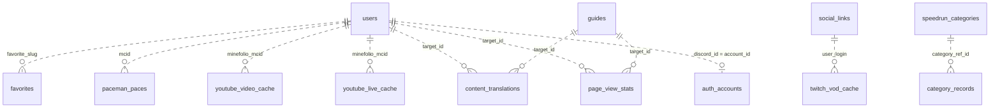

# データベース構成（テーブル一覧・ER 図）

Minefolio の DB スキーマ全体を俯瞰するためのドキュメント。**単一情報源は [`app/lib/schema.ts`](../app/lib/schema.ts)** で、この文書はそこから起こした地図。列を追加・変更したらこの文書も更新する。

- DBMS: **libSQL（Turso）／ SQLite 方言**、ORM は **Drizzle ORM**
- 主キーは原則 `text` の **CUID2**（`@paralleldrive/cuid2` の `createId()`）。例外は `app_meta`（`key` が PK）と better-auth 管理テーブル
- テーブル数: **40**
- スキーマ変更の反映手順は [CLAUDE.md](../CLAUDE.md) の「データベース」節（`db:push` / `db:push:remote`）を参照

## 凡例

この文書の型表記は Drizzle の列定義を SQLite の実体に沿って短縮したもの。

| 表記 | Drizzle 定義 | SQLite 実体 |
|---|---|---|
| `text` | `text()` | TEXT |
| `int` | `integer()` | INTEGER |
| `real` | `real()` | REAL |
| `bool` | `integer({ mode: "boolean" })` | INTEGER（0 / 1） |
| `ts` | `integer({ mode: "timestamp" })` | INTEGER（Unix 秒） |
| `enum` | `text({ enum: [...] })` | TEXT（アプリ層で値を制約。DB 制約はない） |
| `json` | `text()` | TEXT（JSON 文字列を格納。`JSON.parse` で読む） |

- 型末尾の **`?` は NULL 許容**。無印は `NOT NULL`（デフォルト値を持つものを含む）
- **`→`** は外部キー（FK）、**`⇢`** は FK 制約を張っていない**弱参照**（アプリ層で解決）
- カラム名は DB 上の物理名（snake_case）。Drizzle のプロパティ名は camelCase（`user_id` ↔ `userId`）

---

## ER 図

### 図 1. 外部キー（FK）関係

`users` を中心に、実際に FK 制約が張られている関係のみを示す。ラベルは子テーブル側の FK カラム名。

```mermaid
erDiagram
    users ||--o| player_configs : user_id
    users ||--o| playstyles : user_id

    users ||--o{ keybindings : user_id
    users ||--o{ custom_keys : user_id
    users ||--o{ key_remaps : user_id
    users ||--o{ custom_actions : user_id
    users ||--o{ external_tools : user_id
    users ||--o{ item_layouts : user_id
    users ||--o{ search_crafts : user_id
    users ||--o{ search_craft_loops : user_id

    users ||--o{ social_links : user_id
    users ||--o{ profile_videos : user_id
    users ||--o{ category_records : user_id
    users ||--o{ custom_fields : user_id
    users ||--o{ external_stats : user_id
    users ||--o{ favorites : user_id
    users ||--o{ slug_history : user_id

    users ||--o{ config_presets : user_id
    users ||--o{ config_history : user_id
    config_presets ||--o{ config_history : preset_id

    users ||--o{ player_rankings : user_id
    users ||--o{ paceman_paces : user_id
    speedrun_categories ||--o{ player_rankings : category_id
    speedrun_categories ||--o{ rankings_cache : category_id

    users ||--o{ guides : author_id
    users ||--o{ guide_likes : user_id
    guides ||--o{ guide_likes : guide_id
    users ||--o{ search_craft_templates : user_id
    users ||--o{ search_craft_template_likes : user_id
    search_craft_templates ||--o{ search_craft_template_likes : template_id
    users ||--o{ profile_reactions : profile_user_id
    users ||--o{ profile_reactions : reactor_user_id

    auth_users ||--o{ auth_sessions : user_id
    auth_users ||--o{ auth_accounts : user_id
```

`onDelete` は明記のない限りすべて **cascade**。例外は `paceman_paces.user_id` と `config_history.preset_id` の 2 つで、どちらも **set null**（→ [整合性ポリシー](#整合性ポリシー)）。

### 図 2. 弱参照（FK なし）

FK を張らずアプリ層で突き合わせている参照。点線で示す。

`api_cache` / `app_meta` / `auth_verifications` はどこも参照しない独立テーブルなので図には現れない。

---

## テーブル一覧

| # | テーブル | 列数 | 用途 | `users` との関係 |
|---|---|---|---|---|
| 1 | [`users`](#users) | 41 | ユーザー基本情報（中心テーブル） | — |
| 2 | [`player_configs`](#player_configs) | 23 | デバイス・ゲーム内設定 | 1 : 1 |
| 3 | [`playstyles`](#playstyles) | 20 | プレイスタイル回答 | 1 : 1 |
| 4 | [`keybindings`](#keybindings) | 7 | キーバインド | 1 : N |
| 5 | [`custom_keys`](#custom_keys) | 10 | カスタムキー定義 | 1 : N |
| 6 | [`key_remaps`](#key_remaps) | 11 | キーリマップ | 1 : N |
| 7 | [`custom_actions`](#custom_actions) | 9 | カスタムアクション | 1 : N |
| 8 | [`external_tools`](#external_tools) | 8 | 外部ツール連携 | 1 : N |
| 9 | [`item_layouts`](#item_layouts) | 9 | アイテム配置 | 1 : N |
| 10 | [`search_crafts`](#search_crafts) | 12 | サーチクラフト | 1 : N |
| 11 | [`search_craft_loops`](#search_craft_loops) | 8 | サーチクラフトの繋ぎ方（Loop） | 1 : N |
| 12 | [`social_links`](#social_links) | 9 | ソーシャルリンク | 1 : N |
| 13 | [`profile_videos`](#profile_videos) | 8 | プロフィールの動画欄 | 1 : N |
| 14 | [`category_records`](#category_records) | 22 | 記録・目標 | 1 : N |
| 15 | [`custom_fields`](#custom_fields) | 8 | カスタム項目 | 1 : N |
| 16 | [`external_stats`](#external_stats) | 7 | 外部サービス統計キャッシュ | 1 : N |
| 17 | [`favorites`](#favorites) | 4 | お気に入りプレイヤー | 1 : N |
| 18 | [`config_presets`](#config_presets) | 17 | 設定プリセット | 1 : N |
| 19 | [`config_history`](#config_history) | 8 | 設定変更履歴 | 1 : N |
| 20 | [`speedrun_categories`](#speedrun_categories) | 12 | スピードランカテゴリ（マスタ） | なし |
| 21 | [`player_rankings`](#player_rankings) | 19 | プレイヤーランキング | 1 : N |
| 22 | [`rankings_cache`](#rankings_cache) | 8 | リーダーボードのキャッシュ | なし |
| 23 | [`paceman_paces`](#paceman_paces) | 11 | PaceMan ペース履歴 | 1 : N（set null） |
| 24 | [`guides`](#guides) | 19 | ガイド記事 | 1 : N |
| 25 | [`guide_likes`](#guide_likes) | 4 | ガイドのいいね | 1 : N |
| 26 | [`search_craft_templates`](#search_craft_templates) | 12 | 公開サーチクラフトテンプレート | 1 : N |
| 27 | [`search_craft_template_likes`](#search_craft_template_likes) | 4 | テンプレートのいいね | 1 : N |
| 28 | [`profile_reactions`](#profile_reactions) | 5 | プロフィールの絵文字リアクション | 1 : N ×2 |
| 29 | [`auth_users`](#auth_users) | 7 | better-auth ユーザー | なし |
| 30 | [`auth_sessions`](#auth_sessions) | 8 | better-auth セッション | なし |
| 31 | [`auth_accounts`](#auth_accounts) | 13 | better-auth OAuth 連携 | なし（弱参照） |
| 32 | [`auth_verifications`](#auth_verifications) | 6 | better-auth 検証トークン | なし |
| 33 | [`api_cache`](#api_cache) | 7 | 汎用 API キャッシュ | なし |
| 34 | [`youtube_video_cache`](#youtube_video_cache) | 13 | YouTube 動画キャッシュ | なし（弱参照） |
| 35 | [`youtube_live_cache`](#youtube_live_cache) | 15 | YouTube ライブ配信キャッシュ | なし（弱参照） |
| 36 | [`twitch_vod_cache`](#twitch_vod_cache) | 12 | Twitch アーカイブキャッシュ | なし（弱参照） |
| 37 | [`content_translations`](#content_translations) | 15 | 利用者コンテンツの自動翻訳 | なし（弱参照） |
| 38 | [`page_view_stats`](#page_view_stats) | 7 | ページビュー集計スナップショット | なし（弱参照） |
| 39 | [`app_meta`](#app_meta) | 3 | アプリ全体の key-value | なし |
| 40 | [`slug_history`](#slug_history) | 5 | 旧 slug からのリダイレクト解決 | 1 : N |

---

## 整合性ポリシー

### `onDelete` の使い分け

| 挙動 | 対象 | 理由 |
|---|---|---|
| **cascade** | 上記以外のすべての FK | ユーザー・親エンティティの削除で子を確実に消す。libSQL は `PRAGMA foreign_keys = 1` が既定なので実際に効く |
| **set null** | `paceman_paces.user_id` | ペース履歴は PaceMan API から **MCID 起点**で取り込む。ユーザー削除後も `mcid` 列が残るため、同じ MCID で再登録されたらバッチで再リンクできる。cascade だと再リンクできる価値ある行が消える |
| **set null** | `config_history.preset_id` | プリセットを消しても変更履歴自体は残す |

### 弱参照（FK を張らない参照）

| 参照元 | 参照先 | FK を張らない理由 |
|---|---|---|
| `favorites.favorite_slug` | `users.slug` | `slug` は MCID 変更等で再生成される可変値。FK にすると変更追従が複雑化する |
| `paceman_paces.mcid` | `users.mcid` | 未登録ランナーのペースも保持するため |
| `youtube_video_cache.minefolio_mcid` `youtube_live_cache.minefolio_mcid` | `users.mcid` | cron が外部 API 起点で蓄積するキャッシュのため |
| `twitch_vod_cache.user_login` | `social_links.identifier` | MCID を持たないユーザーの VOD も扱うため（小文字で突合） |
| `content_translations.target_id` | `guides.id` / `users.id` | `target_type` で参照先が変わる多態参照 |
| `page_view_stats.target_id` | `users.id` / `guides.id` | 同上。cron が `target_type` 単位で全置換するので孤児は次回同期で消える |
| `category_records.category_ref_id` | `speedrun_categories.id` | 列は用意しているが制約は張っていない |
| `auth_accounts.account_id` | `users.discord_id` | better-auth 側のテーブル。アプリは `eq(users.discordId, session.user.id)` で毎回引き直す |

副作用として `favorites` は参照先ユーザーの削除・`slug` 変更で孤児化しうる。必要なら
`DELETE FROM favorites WHERE favorite_slug NOT IN (SELECT slug FROM users)` で GC する。

### `slug_history` の一意性

`slug_history.slug` は必ず小文字化して保存し、UNIQUE 索引で「1 slug（小文字）＝常に最新の
元所有者 1 人だけ」を保証する。同じ旧 slug を別ユーザーが再度手放した場合は
`onConflictDoUpdate` で上書きする（履歴を積み増さない）。`user_id` は `users.id` への
FK（cascade）なので、退会（`users` 行削除）で該当ユーザーの履歴も自動的に消える。
読み書きは [`app/lib/slug-history.server.ts`](../app/lib/slug-history.server.ts) に集約する。

### better-auth テーブルとの関係

`auth_users` と `users` の間に FK はない。better-auth のセッション `session.user.id` は **Discord ID** なので、
アプリ側は毎回 `users.discord_id` で引き直す（[`app/lib/session.ts`](../app/lib/session.ts) /
[`app/lib/api-auth.server.ts`](../app/lib/api-auth.server.ts)）。詳細は [auth.md](./auth.md)。

---

## テーブル定義

### コア

#### `users`

ユーザー基本情報。`slug` は MCID 登録済みなら MCID、未登録なら `@{discord_id}`（[`app/lib/slug.ts`](../app/lib/slug.ts)）。

| カラム | 型 | 制約・参照 |
|---|---|---|
| `id` | text | PK（CUID2） |
| `discord_id` | text | UNIQUE |
| `mcid` | text? | UNIQUE |
| `uuid` | text? | UNIQUE |
| `slug` | text | UNIQUE |
| `display_name` | text? | |
| `display_name_alphabet` | text? | 英語ロケールでの表示名。未入力なら `display_name` にフォールバック |
| `discord_avatar` | text? | |
| `bio` | text? | |
| `has_imported` | bool | 既定 false |
| `profile_visibility` | enum | `public` / `unlisted` / `private`。既定 `public` |
| `profile_pose` | enum? | `standing` / `walking` / `waving` |
| `slim_skin` | bool? | |
| `location` | text? | |
| `pronouns` | text? | |
| `default_profile_tab` | enum? | `PROFILE_TAB_VALUES`（`app/lib/profile-tabs.ts`）。既定はアプリ側で `profile` |
| `featured_video_url` | text? | |
| `main_edition` | enum? | `java` / `bedrock` |
| `main_platform` | enum? | `pc_windows` / `pc_mac` / `pc_linux` / `switch` / `mobile` / `other` |
| `role` | enum? | `viewer` / `runner` |
| `input_method` | enum? | `keyboard_mouse` / `controller` / `touch` |
| `input_method_badge` | enum? | **未使用**（`input_method` に一本化済み。DDL 乖離防止のため残置） |
| `short_bio` | text? | |
| `speedruncom_username` | text? | |
| `speedruncom_id` | text? | |
| `speedruncom_last_sync` | ts? | |
| `hidden_speedrun_records` | json? | 非表示にする run ID の配列 |
| `show_paceman_on_home` | bool? | 既定 true |
| `show_twitch_on_home` | bool? | 既定 true |
| `show_youtube_on_home` | bool? | 既定 true |
| `show_ranked_stats` | bool? | 既定 true |
| `show_paceman_stats` | bool? | 既定 true |
| `profile_views` | int | 既定 0 |
| `last_active` | ts? | |
| `custom_skin_url` | text? | Vercel Blob の URL |
| `custom_skin_model` | enum? | `default` / `slim` |
| `custom_skin_updated_at` | ts? | |
| `created_at` | ts | |
| `updated_at` | ts | |
| `pinned_speedrun_records` | json? | ピン留めする run ID の配列 |
| `rta_started_year_month` | text? | `"YYYY-MM"` |

索引: `(discord_id)` / `(mcid)` / `(uuid)` / `(slug)` / `(speedruncom_id)`

#### `player_configs`

デバイス・ゲーム内設定。`user_id` が UNIQUE なので **1 ユーザー 1 行**。

| カラム | 型 | 制約・参照 |
|---|---|---|
| `id` | text | PK |
| `user_id` | text | UNIQUE, → `users.id` (cascade) |
| `keyboard_layout` | enum? | `JIS` / `US` / `JIS_TKL` / `US_TKL` |
| `keyboard_model` | text? | |
| `mouse_dpi` | int? | |
| `game_sensitivity` | real? | |
| `windows_speed` | int? | |
| `windows_speed_multiplier` | real? | 設定時は `windows_speed` より優先 |
| `mouse_acceleration` | bool? | 既定 false |
| `raw_input` | bool? | 既定 true |
| `cm360` | real? | |
| `mouse_model` | text? | |
| `toggle_sprint` | bool? | |
| `toggle_sneak` | bool? | |
| `auto_jump` | bool? | |
| `game_language` | text? | |
| `fov` | int? | |
| `gui_scale` | int? | |
| `finger_assignments` | json? | 指割り当て |
| `controller_settings` | json? | `{ controllerModel, lookSensitivity, invertYAxis, vibration }` |
| `notes` | text? | |
| `created_at` | ts | |
| `updated_at` | ts | |

#### `playstyles`

プレイスタイル回答。**全項目 NULL 許容（未回答）**。選択肢と表示条件は [`app/lib/playstyle.ts`](../app/lib/playstyle.ts)。
条件付き項目は表示条件を満たさなくなっても値をクリアしない方針のため、DB 側に条件の制約は持たせない。

| カラム | 型 | 制約・参照 |
|---|---|---|
| `id` | text | PK |
| `user_id` | text | UNIQUE, → `users.id` (cascade) |
| `versions` | json? | `VersionKey[]`（`"java:1_16_1_19"` 形式） |
| `categories` | json? | `CategoryKey[]` |
| `main_version` | text? | Java / Bedrock バッジの決定に使う |
| `main_category` | text? | |
| `hotbar_switching` | enum? | `hotkeys` / `hotkeys_sometimes_wheel` / `wheel_sometimes_hotkeys` / `wheel` |
| `search_craft` | enum? | `does` / `does_a_little` / `does_not`。`does_not` なら SC タブを非表示 |
| `half_shift` | enum? | `actively` / `does` / `sometimes` / `rarely` / `does_not` |
| `item_layout_policy` | enum? | `strict` / `rough` / `mood` |
| `click_methods` | json? | `["normal","jitter","butterfly","drag"]` の部分集合 |
| `drag_tape_type` | text? | `click_methods` に `drag` を含む場合のみ表示 |
| `uses_mousepad` | enum? | `uses` / `does_not_use` |
| `mousepad_type` | text? | `uses_mousepad === "uses"` の場合のみ表示 |
| `zero_cycle` | enum? | `half_shift` と同スケール |
| `ground_zero` | enum? | `can` / `cannot` |
| `oneshot` | enum? | `can` / `cannot` |
| `favorite_bastion` | enum? | `housing` / `stables` / `bridge` / `treasure` |
| `created_at` | ts | |
| `updated_at` | ts | |

---

### キー配置・入力設定

すべて `users` 1 : N（cascade）。仕様は [keybindings.md](./keybindings.md) / [items-searchcraft.md](./items-searchcraft.md)。

#### `keybindings`

| カラム | 型 | 制約・参照 |
|---|---|---|
| `id` | text | PK |
| `user_id` | text | → `users.id` (cascade) |
| `action` | text | |
| `key_code` | text | |
| `category` | enum | `movement` / `combat` / `inventory` / `ui` |
| `created_at` | ts | |
| `updated_at` | ts | |

索引: **UNIQUE** `(user_id, action)` / `(user_id)` / `(category)`

#### `custom_keys`

| カラム | 型 | 制約・参照 |
|---|---|---|
| `id` | text | PK |
| `user_id` | text | → `users.id` (cascade) |
| `key_code` | text | |
| `key_name` | text | |
| `category` | enum | `mouse` / `keyboard` / `controller` |
| `position` | json? | `{ x, y }` |
| `size` | json? | `{ width, height }` |
| `notes` | text? | |
| `created_at` | ts | |
| `updated_at` | ts | |

索引: **UNIQUE** `(user_id, key_code)`

#### `key_remaps`

| カラム | 型 | 制約・参照 |
|---|---|---|
| `id` | text | PK |
| `user_id` | text | → `users.id` (cascade) |
| `source_key` | text | 修飾キー組み合わせ可（`"Ctrl+KeyA"` 等） |
| `target_key` | text? | 単一キーのみ |
| `software` | text? | |
| `notes` | text? | |
| `output_mode` | enum? | `key` / `character`。既定 `key` |
| `output_character` | text? | `output_mode = "character"` 時の出力文字 |
| `created_at` | ts | |
| `updated_at` | ts | |
| `remap_type` | enum | `KEY_REMAP_TYPES`（`unset` / `all` / `trigger` / `chat`）。**NOT NULL 必須**（SQLite の UNIQUE は NULL を別値扱いするため） |

索引: **UNIQUE** `(user_id, source_key, remap_type)`

#### `custom_actions`

| カラム | 型 | 制約・参照 |
|---|---|---|
| `id` | text | PK |
| `user_id` | text | → `users.id` (cascade) |
| `action_name` | text | |
| `description` | text? | |
| `category` | enum | `other` / `macro` / `tool`。既定 `other` |
| `trigger_key` | text | 修飾キー組み合わせ可 |
| `display_order` | int | 既定 0 |
| `created_at` | ts | |
| `updated_at` | ts | |

索引: **UNIQUE** `(user_id, trigger_key)` / `(user_id)` / `(category)`

#### `external_tools`

| カラム | 型 | 制約・参照 |
|---|---|---|
| `id` | text | PK |
| `user_id` | text | → `users.id` (cascade) |
| `trigger_key` | text | |
| `tool_name` | text | |
| `action_name` | text | |
| `description` | text? | |
| `created_at` | ts | |
| `updated_at` | ts | |

索引: **UNIQUE** `(user_id, trigger_key, tool_name)`

#### `item_layouts`

| カラム | 型 | 制約・参照 |
|---|---|---|
| `id` | text | PK |
| `user_id` | text | → `users.id` (cascade) |
| `segment` | text | `overworld` / `nether` / `end` / `stronghold` / `custom_*` |
| `slots` | json | |
| `offhand` | json? | |
| `notes` | text? | |
| `display_order` | int | 既定 0 |
| `created_at` | ts | |
| `updated_at` | ts | |

索引: **UNIQUE** `(user_id, segment)`

#### `search_crafts`

| カラム | 型 | 制約・参照 |
|---|---|---|
| `id` | text | PK |
| `user_id` | text | → `users.id` (cascade) |
| `sequence` | int | |
| `items` | json | |
| `keys` | json | |
| `search_str` | text? | |
| `comment` | text? | |
| `timing` | enum? | `ow` / `bastion` / `bastion_fort` / `fortress` / `blinded` / `other`（null = 区分なし） |
| `created_at` | ts | |
| `updated_at` | ts | |
| `with_shift` | bool | 既定 false。true なら入力キーはシフト後の文字を優先して逆引き |
| `search_variations` | text? | JSON: `{ str: string; withShift: boolean }[]`（複数サーチ文字列バリエーション）。`search_str` / `with_shift` は第1バリエーションのミラーとして書き込み継続（旧リーダー・ロールバック互換）。null は未設定＝旧単一形式のみ（読み取り側で1件に正規化） |

索引: **UNIQUE** `(user_id, sequence)`

#### `search_craft_loops`

サーチクラフトの繋ぎ方（Loop）。作業台を閉じずに連続クラフトするキー操作列（BS / 全選択 / Home + 打鍵）を、既存の `search_crafts` 行を id 参照で順に繋いで表す。

| カラム | 型 | 制約・参照 |
|---|---|---|
| `id` | text | PK |
| `user_id` | text | → `users.id` (cascade) |
| `sequence` | int | |
| `steps` | json | `LoopStepData[]`。`craftId`（`search_crafts.id` への参照。DB制約なし、アプリ層で管理）＋遷移メタ |
| `comment` | text? | |
| `timing` | enum? | `ow` / `bastion` / `bastion_fort` / `fortress` / `blinded` / `other`（null = 区分なし） |
| `created_at` | ts | |
| `updated_at` | ts | |

索引: **UNIQUE** `(user_id, sequence)`

仕様詳細（`LoopStepData` の形・遷移3方式のセマンティクス・プリセット/テンプレートスナップショットでの `craftSeq` 参照）は [items-searchcraft.md](./items-searchcraft.md) の「繋ぎ方（Loop）」を参照。

---

### プロフィール表示

仕様は [profiles.md](./profiles.md) / [favorites.md](./favorites.md)。

#### `social_links`

| カラム | 型 | 制約・参照 |
|---|---|---|
| `id` | text | PK |
| `user_id` | text | → `users.id` (cascade) |
| `platform` | enum | `speedruncom` / `youtube` / `twitch` / `twitter` / `custom` |
| `identifier` | text | ユーザー名やチャンネル ID。`twitch_vod_cache.user_login` の突合先 |
| `custom_label` | text? | |
| `custom_url` | text? | |
| `display_order` | int | 既定 0 |
| `created_at` | ts | |
| `updated_at` | ts | |

索引: `(user_id)` / `(platform)`

#### `profile_videos`

| カラム | 型 | 制約・参照 |
|---|---|---|
| `id` | text | PK |
| `user_id` | text | → `users.id` (cascade) |
| `url` | text | YouTube 動画 URL |
| `title` | text? | |
| `is_pinned` | bool | 既定 false。ピン留めは先頭・拡大表示 |
| `display_order` | int | 既定 0 |
| `created_at` | ts | |
| `updated_at` | ts | |

索引: `(user_id)`

#### `category_records`

記録（自己ベスト）と目標を 1 テーブルに統合したもの。

| カラム | 型 | 制約・参照 |
|---|---|---|
| `id` | text | PK |
| `user_id` | text | → `users.id` (cascade) |
| `category` | text | |
| `category_display_name` | text | |
| `subcategory` | text? | |
| `version` | text? | |
| `category_ref_id` | text? | ⇢ `speedrun_categories.id`（FK 制約なし） |
| `record_type` | enum | `speedruncom` / `ranked` / `custom` |
| `personal_best` | int? | ミリ秒 |
| `pb_date` | ts? | |
| `pb_video_url` | text? | |
| `pb_notes` | text? | |
| `target_time` | int? | ミリ秒 |
| `target_deadline` | ts? | |
| `target_notes` | text? | |
| `achieved` | bool | 既定 false |
| `achieved_at` | ts? | |
| `is_visible` | bool | 既定 true |
| `display_order` | int | 既定 0 |
| `created_at` | ts | |
| `updated_at` | ts | |
| `is_pinned` | bool | 既定 false |

索引: **UNIQUE** `(user_id, category, record_type)` / `(user_id)` / `(category)` / `(record_type)`

#### `custom_fields`

**未使用**（アプリコードからの参照なし。削除候補 — 実テーブルの drop はリモートDBのデータ確認の上で別途実施）。

| カラム | 型 | 制約・参照 |
|---|---|---|
| `id` | text | PK |
| `user_id` | text | → `users.id` (cascade) |
| `field_name` | text | |
| `field_value` | text | |
| `field_type` | enum | `text` / `number` / `url` / `date`。既定 `text` |
| `display_order` | int | 既定 0 |
| `created_at` | ts | |
| `updated_at` | ts | |

#### `external_stats`

Speedrun.com / MCSR Ranked の統計を JSON でキャッシュする（[`app/lib/external-stats.ts`](../app/lib/external-stats.ts)）。

| カラム | 型 | 制約・参照 |
|---|---|---|
| `id` | text | PK |
| `user_id` | text | → `users.id` (cascade) |
| `service` | enum | `speedruncom` / `ranked` |
| `data` | json | |
| `last_fetched` | ts | |
| `created_at` | ts | |
| `updated_at` | ts | |

索引: **UNIQUE** `(user_id, service)` / `(user_id)` / `(service)`

#### `favorites`

| カラム | 型 | 制約・参照 |
|---|---|---|
| `id` | text | PK |
| `user_id` | text | → `users.id` (cascade) |
| `favorite_slug` | text | ⇢ `users.slug`（FK 制約なし。→ [整合性ポリシー](#弱参照fk-を張らない参照)） |
| `created_at` | ts | |

索引: **UNIQUE** `(user_id, favorite_slug)` / `(user_id)`

#### `slug_history`

MCID 登録（`set_mcid`）・削除（`remove_mcid`）で `users.slug` が変わるたびに旧 slug を記録し、
`/player/:slug` 等が 404 になったとき現在の slug へ 302 リダイレクトするための履歴
（[`app/lib/slug-history.server.ts`](../app/lib/slug-history.server.ts)）。Mojang API 起点の
フォールバック（`player-slug-fallback.server.ts`）より優先して解決する。詳細は
[profiles.md](./profiles.md)、一意性の運用は [整合性ポリシー](#slug_history-の一意性)を参照。

| カラム | 型 | 制約・参照 |
|---|---|---|
| `id` | text | PK |
| `slug` | text | UNIQUE。旧 slug。小文字化して保存（検索は常に小文字一致） |
| `user_id` | text | → `users.id` (cascade) |
| `created_at` | ts | |
| `updated_at` | ts | |

索引: **UNIQUE** `(slug)` / `(user_id)`

---

### プリセット・変更履歴

仕様は [presets.md](./presets.md)。

#### `config_presets`

ライブテーブル（`keybindings` 等）のスナップショットを JSON で保持する。

| カラム | 型 | 制約・参照 |
|---|---|---|
| `id` | text | PK |
| `user_id` | text | → `users.id` (cascade) |
| `name` | text | |
| `description` | text? | |
| `is_active` | bool | 編集対象のプリセット（ユーザーごと高々 1 件）。既定 false |
| `is_main` | bool | 公開面に出すプリセット（ユーザーごと高々 1 件）。`is_active` とは独立。既定 false |
| `keybindings_data` | json? | |
| `player_config_data` | json? | |
| `remaps_data` | json? | |
| `finger_assignments_data` | json? | |
| `item_layouts_data` | json? | |
| `search_crafts_data` | json? | |
| `search_craft_loops_data` | json? | 繋ぎ方（Loop）のスナップショット。`craftSeq`（同一スナップショット内 crafts の `sequence` 値）でステップの参照先を表す（スナップショットは行 id を保持しないため） |
| `custom_keys_data` | json? | |
| `custom_actions_data` | json? | |
| `created_at` | ts | |
| `updated_at` | ts | |

索引: `(user_id)` / `(is_active)` / `(is_main)`

#### `config_history`

| カラム | 型 | 制約・参照 |
|---|---|---|
| `id` | text | PK |
| `user_id` | text | → `users.id` (cascade) |
| `change_type` | enum | `keybinding` / `device` / `game_setting` / `remap` / `preset_switch` |
| `change_description` | text | |
| `previous_data` | json? | |
| `new_data` | json? | |
| `preset_id` | text? | → `config_presets.id` (**set null**) |
| `created_at` | ts | |

索引: `(user_id)` / `(created_at)` / `(change_type)`

---

### 記録・ランキング

仕様は [rankings-stats.md](./rankings-stats.md) / [home-live.md](./home-live.md)。

#### `speedrun_categories`

カテゴリのマスタ表。`users` への FK は持たない。

| カラム | 型 | 制約・参照 |
|---|---|---|
| `id` | text | PK |
| `name` | text | 表示名（例: `Any% Glitchless RSG`） |
| `slug` | text | UNIQUE |
| `description` | text? | |
| `speedruncom_game_id` | text? | 例: `j1npme6p` |
| `speedruncom_category_id` | text? | 例: `mkeyl926` |
| `speedruncom_variables` | json? | サブカテゴリ変数 |
| `category_type` | enum | `speedruncom` / `ranked` / `custom` |
| `is_active` | bool | 既定 true |
| `display_order` | int | 既定 0 |
| `created_at` | ts | |
| `updated_at` | ts | |

索引: `(slug)` / `(category_type)` / `(speedruncom_category_id)`

#### `player_rankings`

| カラム | 型 | 制約・参照 |
|---|---|---|
| `id` | text | PK |
| `user_id` | text | → `users.id` (cascade) |
| `ranking_type` | enum | `speedruncom` / `ranked_pb` / `ranked_elo` |
| `category_id` | text? | → `speedrun_categories.id` (cascade)。Ranked Elo では null |
| `speedruncom_run_id` | text? | |
| `speedruncom_player_id` | text? | |
| `verification_status` | enum? | `verified` / `new` / `rejected`。既定 `verified` |
| `time_ms` | int? | |
| `time_formatted` | text? | |
| `elo_rate` | int? | |
| `wins` | int? | |
| `losses` | int? | |
| `win_rate` | real? | |
| `record_date` | text? | |
| `video_url` | text? | |
| `run_weblink` | text? | |
| `last_fetched` | ts | |
| `created_at` | ts | |
| `updated_at` | ts | |

索引: `(user_id)` / `(ranking_type)` / `(category_id)` / `(time_ms)` / `(elo_rate)`

#### `rankings_cache`

**未使用**（アプリコードからの参照なし。削除候補 — 実テーブルの drop はリモートDBのデータ確認の上で別途実施）。

| カラム | 型 | 制約・参照 |
|---|---|---|
| `id` | text | PK |
| `cache_key` | text | UNIQUE |
| `cache_type` | enum | `speedruncom_leaderboard` / `ranked_leaderboard` |
| `category_id` | text? | → `speedrun_categories.id` (cascade) |
| `data` | json | |
| `expires_at` | ts | |
| `last_fetched` | ts | |
| `created_at` | ts | |

索引: `(cache_key)` / `(cache_type)` / `(expires_at)` / `(category_id)`

#### `paceman_paces`

PaceMan API から取り込むペース履歴（[`app/lib/paceman.ts`](../app/lib/paceman.ts)）。1 ランのスプリットが複数行になる。

| カラム | 型 | 制約・参照 |
|---|---|---|
| `id` | text | PK |
| `paceman_run_id` | int | 同一ランのスプリットをまとめるキー |
| `mcid` | text | ⇢ `users.mcid`（`user_id` が null でもここから再リンクできる） |
| `user_id` | text? | → `users.id` (**set null**) |
| `timeline` | text | `Enter Nether` / `Eye Spy` 等 |
| `rta` | int | ミリ秒 |
| `igt` | int? | ミリ秒 |
| `date` | ts | |
| `is_nether_enter` | bool | 既定 false |
| `is_2nd_structure_or_later` | bool | 既定 false |
| `created_at` | ts | |

索引: `(mcid)` / `lower(mcid)` / `(user_id)` / `(date)` / `(timeline)` / `(is_nether_enter)` / `(is_2nd_structure_or_later)` / `(paceman_run_id)`

> `lower(mcid)` は**式インデックス**。drizzle-kit push は式インデックスの差分を検出しないため `db:push` では反映されない。
> 実 DB への適用は `scripts/add-paceman-mcid-lower-index.ts`（手動 DDL）で行う。

---

### 投稿・いいね・リアクション

仕様は [guides.md](./guides.md) / [likes.md](./likes.md) / [search-craft-templates.md](./search-craft-templates.md) / [profile-reactions.md](./profile-reactions.md)。

#### `guides`

`draft_*` は公開版と独立した編集中の内容。いずれかが非 null なら「未コミットのドラフトあり」。

| カラム | 型 | 制約・参照 |
|---|---|---|
| `id` | text | PK |
| `author_id` | text | → `users.id` (cascade) |
| `slug` | text | |
| `title` | text | |
| `summary` | text? | |
| `content` | text | 既定 `""` |
| `cover_image_url` | text? | |
| `is_published` | bool | 既定 false |
| `tags` | json | 既定 `"[]"` |
| `view_count` | int | 既定 0 |
| `created_at` | ts | |
| `updated_at` | ts | |
| `draft_title` | text? | |
| `draft_summary` | text? | |
| `draft_content` | text? | |
| `draft_cover_image_url` | text? | |
| `draft_tags` | json? | |
| `draft_updated_at` | ts? | |
| `is_pinned` | bool | 既定 false |

索引: **UNIQUE** `(author_id, slug)` / `(is_published, updated_at)` / `(author_id)`

#### `guide_likes`

| カラム | 型 | 制約・参照 |
|---|---|---|
| `id` | text | PK |
| `guide_id` | text | → `guides.id` (cascade) |
| `user_id` | text | → `users.id` (cascade) |
| `created_at` | ts | |

索引: **UNIQUE** `(guide_id, user_id)` / `(user_id, guide_id)`

いいね数は非正規化列を持たず **`COUNT(*)` を都度算出**する。対象列を先頭に置いた UNIQUE 索引がカバリング索引として働く（理由は [likes.md](./likes.md)）。

#### `search_craft_templates`

| カラム | 型 | 制約・参照 |
|---|---|---|
| `id` | text | PK |
| `user_id` | text | → `users.id` (cascade) |
| `title` | text | |
| `description` | text? | |
| `crafts_data` | json | `PresetSearchCraftData[]`（`config_presets` と同一形式） |
| `remaps_data` | json? | 公開時に含めた場合のみ |
| `is_published` | bool | 既定 true |
| `apply_count` | int | 既定 0 |
| `created_at` | ts | |
| `updated_at` | ts | |
| `game_language` | text? | 想定するゲーム内言語（例: `ja_jp`） |
| `loops_data` | json? | 繋ぎ方（Loop）のスナップショット。`config_presets.search_craft_loops_data` と同一形式（`craftSeq = craftIndex + 1` が恒等） |

索引: `(user_id)` / `(is_published, created_at)`

#### `search_craft_template_likes`

| カラム | 型 | 制約・参照 |
|---|---|---|
| `id` | text | PK |
| `template_id` | text | → `search_craft_templates.id` (cascade) |
| `user_id` | text | → `users.id` (cascade) |
| `created_at` | ts | |

索引: **UNIQUE** `(template_id, user_id)` / `(user_id, template_id)`

#### `profile_reactions`

固定 8 絵文字のリアクション。`users` を 2 回参照する（押された側／押した側）ので、Drizzle のリレーションは
`relationName`（`profileReactionsReceived` / `profileReactionsGiven`）で方向を区別する。

| カラム | 型 | 制約・参照 |
|---|---|---|
| `id` | text | PK |
| `profile_user_id` | text | → `users.id` (cascade)。リアクションされたプロフィール |
| `reactor_user_id` | text | → `users.id` (cascade)。押したユーザー |
| `emoji` | text | |
| `created_at` | ts | |

索引: **UNIQUE** `(profile_user_id, emoji, reactor_user_id)` / `(reactor_user_id, profile_user_id, emoji)`

いいねとの差分: 自分のプロフィールにも押せる（self 拒否なし）／可視性は「private かつ本人以外」のみ拒否。

---

### 認証（better-auth）

better-auth が管理するテーブル群。`users` との FK はない（→ [better-auth テーブルとの関係](#better-auth-テーブルとの関係)）。

#### `auth_users`

| カラム | 型 | 制約・参照 |
|---|---|---|
| `id` | text | PK（better-auth 発行） |
| `name` | text? | |
| `email` | text? | UNIQUE |
| `email_verified` | bool? | |
| `image` | text? | |
| `created_at` | ts | |
| `updated_at` | ts | |

#### `auth_sessions`

| カラム | 型 | 制約・参照 |
|---|---|---|
| `id` | text | PK |
| `expires_at` | ts | |
| `token` | text | UNIQUE |
| `ip_address` | text? | |
| `user_agent` | text? | |
| `user_id` | text | → `auth_users.id` (cascade) |
| `created_at` | ts | |
| `updated_at` | ts | |

#### `auth_accounts`

| カラム | 型 | 制約・参照 |
|---|---|---|
| `id` | text | PK |
| `account_id` | text | `provider_id = "discord"` のとき ⇢ `users.discord_id` |
| `provider_id` | text | |
| `user_id` | text | → `auth_users.id` (cascade) |
| `access_token` | text? | |
| `refresh_token` | text? | |
| `id_token` | text? | |
| `access_token_expires_at` | ts? | |
| `refresh_token_expires_at` | ts? | |
| `scope` | text? | |
| `password` | text? | |
| `created_at` | ts | |
| `updated_at` | ts | |

#### `auth_verifications`

| カラム | 型 | 制約・参照 |
|---|---|---|
| `id` | text | PK |
| `identifier` | text | |
| `value` | text | |
| `expires_at` | ts | |
| `created_at` | ts | |
| `updated_at` | ts | |

---

### キャッシュ・集計

cron（`/api/cron/*`）が蓄積・更新する層。いずれも FK を持たない。

#### `api_cache`

| カラム | 型 | 制約・参照 |
|---|---|---|
| `id` | text | PK |
| `cache_key` | text | UNIQUE |
| `cache_type` | enum | `youtube_videos` / `recent_paces` / `twitch_streams` / `live_runs` / `social_stats` |
| `data` | json | |
| `expires_at` | ts | |
| `created_at` | ts | |
| `updated_at` | ts | |

索引: `(cache_key)` / `(cache_type)` / `(expires_at)`

#### `youtube_video_cache`

| カラム | 型 | 制約・参照 |
|---|---|---|
| `id` | text | PK |
| `video_id` | text | UNIQUE |
| `channel_id` | text | |
| `minefolio_mcid` | text? | ⇢ `users.mcid` |
| `title` | text | |
| `description` | text? | |
| `thumbnail_url` | text? | |
| `channel_title` | text? | |
| `published_at` | ts | |
| `last_verified_at` | ts | |
| `is_available` | bool | 既定 true |
| `created_at` | ts | |
| `updated_at` | ts | |

索引: `(video_id)` / `(channel_id)` / `(minefolio_mcid)` / `(published_at)` / `(is_available)`

#### `youtube_live_cache`

| カラム | 型 | 制約・参照 |
|---|---|---|
| `id` | text | PK |
| `video_id` | text | UNIQUE |
| `channel_id` | text | |
| `minefolio_mcid` | text? | ⇢ `users.mcid` |
| `title` | text | |
| `description` | text? | |
| `thumbnail_url` | text? | |
| `channel_title` | text? | |
| `live_broadcast_content` | enum | `live` / `upcoming` / `none` |
| `scheduled_start_time` | ts? | |
| `actual_start_time` | ts? | |
| `concurrent_viewers` | int? | |
| `last_checked_at` | ts | |
| `created_at` | ts | |
| `updated_at` | ts | |

索引: `(video_id)` / `(channel_id)` / `(minefolio_mcid)` / `(live_broadcast_content)`

#### `twitch_vod_cache`

MCID を持たないユーザーの VOD も扱うため **`mcid` 列を持たない**。`user_login`（小文字）を
`social_links.identifier` と突合して読み時に解決する。

| カラム | 型 | 制約・参照 |
|---|---|---|
| `id` | text | PK |
| `vod_id` | text | UNIQUE |
| `user_login` | text | ⇢ `social_links.identifier`（小文字） |
| `title` | text | |
| `thumbnail_url` | text? | 処理中 VOD は null |
| `channel_title` | text? | |
| `duration_seconds` | int? | |
| `published_at` | ts | |
| `last_verified_at` | ts | |
| `is_available` | bool | 既定 true |
| `created_at` | ts | |
| `updated_at` | ts | |

索引: `(user_login)` / `(published_at)` / `(is_available)`

#### `content_translations`

ガイド本文・プロフィール文の機械翻訳（[translation.md](./translation.md)）。対象ごとにテーブルを分けず
`target_type` で束ねるため FK は張らない。対象削除時は書き込み経路で明示的に消す。

| カラム | 型 | 制約・参照 |
|---|---|---|
| `id` | text | PK |
| `target_type` | text | `guide` / `userBio`（将来 `template` 等） |
| `target_id` | text | ⇢ `guides.id` / `users.id` |
| `locale` | text | `app/lib/locale.ts` の `Locale` |
| `source_hash` | text | 原文のハッシュ（失効判定） |
| `glossary_version` | int | 用語集バージョン（失効判定） |
| `title` | text? | |
| `summary` | text? | |
| `content` | text? | |
| `status` | text | `pending` / `ready` / `failed`。既定 `pending` |
| `engine` | text? | `anthropic` 等 |
| `model` | text? | |
| `error` | text? | `status = "failed"` のときのみ |
| `created_at` | ts | |
| `updated_at` | ts | |

索引: **UNIQUE** `(target_type, target_id, locale)` / `(status, updated_at)`

読み取り側は「`source_hash` 一致 かつ `glossary_version` 一致 かつ `status = ready`」のときだけ訳文を使い、それ以外は原文へフォールバックする。

#### `page_view_stats`

Vercel Web Analytics の path 別 PV を Minefolio の対象へ解決したスナップショット
（[`app/lib/page-view-stats.server.ts`](../app/lib/page-view-stats.server.ts)）。ガイド一覧・走者一覧の「人気順」の軸。

| カラム | 型 | 制約・参照 |
|---|---|---|
| `id` | text | PK |
| `target_type` | enum | `profile` / `guide` |
| `target_id` | text | ⇢ `users.id` / `guides.id` |
| `pageviews` | int | 既定 0。大小文字違いのパスは合算済み |
| `window_start` | ts | |
| `window_end` | ts | |
| `fetched_at` | ts | |

索引: **UNIQUE** `(target_type, target_id)`

cron（`/api/cron/update-page-views`）が数時間おきに `target_type` 単位で全置換する。読み手は対象テーブル側を起点に相関サブクエリで引くため、孤児行が一覧へ漏れることはない。

#### `app_meta`

アプリ全体の key-value メタデータ（例: リリース通知の最終通知バージョン `release_notify:last_version`）。

| カラム | 型 | 制約・参照 |
|---|---|---|
| `key` | text | PK |
| `value` | text | |
| `updated_at` | ts | |

---

## スキーマ変更の運用

詳細は [CLAUDE.md](../CLAUDE.md) を参照。要点のみ:

- **`app/lib/schema.ts` の変更は `platform-worker` に集約する**（全機能で共有するため）
- 反映は `pnpm db:push`（ローカル）/ `pnpm db:push:remote`（リモート Turso、`.env.remote` を読む）。
  `.env` は常に `file:local.db` 固定で、リモート URL を書くとガードが働いて各所で拒否される
- **列は必ず末尾に追加する**。`ALTER TABLE ... ADD COLUMN` は物理的に末尾へ足されるため、
  schema.ts の途中に挿入すると `db:push` がテーブル再作成を選んでデータ破損を起こす
- **falsy デフォルトの NOT NULL 列**を既存テーブルへ追加すると `db:push` が TRUNCATE を提案することがある。
  その場合は push せず、`scripts/` に dry-run 既定 + `--apply` フラグの一回限り tsx スクリプトを作って手動 DDL で適用する
- 式インデックス（`lower(mcid)` 等）は drizzle-kit push が差分検出できない。手動 DDL スクリプトで適用する

### 運用ノート: ローカル `db:push` が式インデックスで恒常的に失敗する

現行の **drizzle-kit 0.31.10**（`package.json` 参照）には、式インデックス `idx_paceman_paces_mcid_lower`（`paceman_paces` の `lower(mcid)`）が絡む push で
**テーブル再構築時の index 一括再列挙経路が式を列名としてクォートしてしまうバグ**があり、ローカル `local.db` への
`pnpm db:push` は `SQLITE_ERROR: no such column: lower("mcid")` で恒常的に中断する（upstream の 0.x 系に修正は入っていない。
drizzle-kit v1 の RC ではパーサが書き直されており、この経路のバグ自体は解消されている見込みだが、本リポジトリは
まだ 0.x 系のため回避が必要）。

このため、**ローカル DDL 反映は `pnpm db:push` ではなく `scripts/` の一回限りスクリプトが信頼できる経路**になっている
（式インデックスに限らず、`local.db` の index 命名ドリフト全般が push を巻き込んで中断させるため）。今回の Loop 機能
追加を含む一連の対応で、以下のスクリプトが `scripts/` に追加・整備された:

| スクリプト | 目的 |
|---|---|
| `add-search-craft-loops.ts` | `search_craft_loops` テーブル＋ `config_presets.search_craft_loops_data` / `search_craft_templates.loops_data` 列を追加（本機能の DDL） |
| `fix-unique-index-names.ts` | inline `.unique()` 列の named unique index（14件）を補完（SQLite の自動 index のみで named index が無いテーブルが push を中断させる） |
| `fix-missing-indexes.ts` | schema.ts が定義する index 全件（98件）を対象に、欠けているものだけ補完する汎用版（`fix-unique-index-names.ts` の対象を包含） |
| `add-player-rankings-table.ts` | `local.db` に存在しなかった `player_rankings` テーブル＋ index を追加（drift の是正） |
| `add-app-meta-table.ts` | `local.db` に存在しなかった `app_meta` テーブルを追加（drift の是正） |
| `drop-orphan-favorites-index.ts` | 旧カラム名時代の孤立 index `idx_favorites_user_mcid` を削除（現行は `idx_favorites_user_slug`） |
| `fix-paceman-expression-index.ts` | `idx_paceman_paces_mcid_lower` を drizzle-kit が期待する SQL テキスト表記（バッククォート識別子・ダブルクォート列参照）で張り替える（上記バグの直接的な回避） |

いずれも `scripts/lib/db-env.ts` の `loadDbEnv()` で接続先を分離し、`IF NOT EXISTS` / 事前存在チェック付きの dry-run 既定スクリプト（[`db-apply` スキル](../.claude/skills/db-apply/SKILL.md)の作法に準拠）。新規テーブル・nullable 列の追加や index の張り替えのみで、既存の行データは変更しない。
